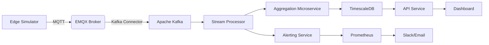
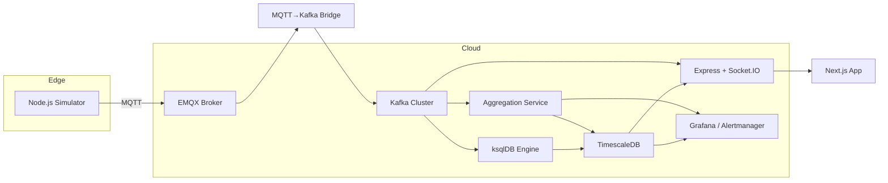

# NebulaFlow: Real-Time Event Processing Platform  
 
*A scalable platform for ingesting, processing, and visualizing IoT sensor data in real time.*

---

## 🚀 Introduction
IoT Pulse is a cloud-native platform that ingests simulated IoT sensor data (temperature, humidity), processes it in real time, computes live metrics, triggers alerts, and powers a dynamic dashboard. Ideal for smart-building demos, it showcases end-to-end event-driven architecture with enterprise-grade scalability.

---

#  Key Features

  -> Multi‑Tenant Security via JWT + Postgres Row‑Level Security

  -> Real‑Time Streaming: MQTT → EMQX → Kafka → Socket.IO → Browser

  -> Durable Storage: Raw sensor_data + 1‑min/5‑min aggregates in TimescaleDB

  -> Interactive Dashboard: Next.js frontend with live & historical charts

  -> Device Management: Onboard/decommission devices per tenant

  -> CSV Export: Download raw or aggregated series

  -> Observability: Prometheus metrics, Grafana dashboards, Slack alerts

  -> CI/CD & Containerization: Dockerized services, single docker-compose up


## 🌐 High-Level Architecture  





# 🏗️ Architecture Overview


```mermaid
[Simulator / Real Sensor]
         │ MQTT
         ▼
      [EMQX Broker]
         │
         ▼
 [Bridge Service] ──▶ Apache Kafka ──▶
         │                              ├─ [Consumer] → TimescaleDB (raw)
         │                              └─ [Aggregator] → TimescaleDB (aggregates)
         ▼
    [Socket.IO / API]
         │ REST & WebSocket
         ▼
  [Next.js Dashboard] ←→ [DeviceManager UI]
         ▲
         └──── CSV Export
         
[Prometheus] ← /metrics ─ [API, Aggregator, Bridge]
[Grafana] visualizes Prometheus & TimescaleDB data
[SlackAlerts] monitors aggregates threshold breaches
```
 
# 📦 Tech Stack

Layer	                      Technology
Messaging            	MQTT (EMQX), Apache Kafka
Time‑Series DB	        TimescaleDB (Postgres)
API & Auth	          Node.js, Express, Socket.IO, JWT, RLS
Aggregation	             Node.js Consumer & KafkaJS
Alerting	               Slack Web API
Frontend              	Next.js, React, SWR, Recharts
Observability       	prom-client, express‑prom-bundle, Prometheus, Grafana
Containerization	        Docker, Docker‑Compose

# 🔧 Prerequisites
Docker & Docker‑Compose

(Locally) Node.js ≥ 18, npm

(Optional) MQTT tool / real sensors


# ⚙️ Quick Start (Docker)

  1. Clone & configure

  ```
  git clone https://github.com/your-org/NebulaFlow.git
  cd NebulaFlow
  cp .env.example .env          # Fill in DB/Kafka/Slack credentials
  ```

  2. Build & spin up all services
   ```
   docker-compose up --build -d

   ```

  3. Initialize Kafka topic (auto‑create enabled)

  ```
  # By default, topics will auto‑create on broker, otherwise:
  docker exec -it kafka kafka-topics --create \
  --topic iot-sensor-data --bootstrap-server kafka:9092 \
  --partitions 3 --replication-factor 1
  ```

 4. Access services
  
  API: http://localhost:5000

  Dashboard: http://localhost:3000

  EMQX UI: http://localhost:18083 (default guest/guest)

  Prometheus: http://localhost:9090

   Grafana: http://localhost:3000 (anonymous)

 5. Simulate data

```
   # Generate a tenant token:
curl -X POST http://localhost:5000/api/generate-token \
  -H "x-master-key: YOUR_MASTER_KEY" \
  -d '{"tenant_id":"tenant-1"}'
#  ➜ { token: "eyJ..." }
export SIM_TOKEN=eyJ...
docker-compose exec simulator node publisher.js --token $SIM_TOKEN
```

6. Log in & visualize

Visit /login in the dashboard, select your tenant, sign in.

Add devices, view real‑time & aggregated charts, download CSVs.


# 📝 Project Structure

```
/
project-root/
├── aggregator/
│   ├── Dockerfile
│   ├── alert.js
│   ├── db.js
│   ├── index.js
│   └── utils.js
├── api/
│   ├── Dockerfile
│   ├── .env
│   ├── db.js
│   ├── kafka-consumer.js
│   ├── server.js
│   └── package.json
├── bridge/
│   ├── Dockerfile
│   ├── kafka-producer.js
│   └── subscriber.js
├── consumer/
│   ├── Dockerfile
│   └── kafka-consumer.js
├── simulator/
│   ├── Dockerfile
│   ├── publisher.js
│   └── package.json
├─ dashboard/       # Next.js React frontend
│   ├─ components/  # LiveChart, DeviceManager, NavBar, LoginPage
│   └─ pages/…
├─ docker-compose.yml
|- Dockerfile
├─ .env             # env vars (DB, Kafka, JWT_SECRET, MASTER_KEY, SLACK_TOKEN,..)
└─ README.md
```

# 🎯 CI/CD & Deployment
GitHub Actions :

Lint & Test on every PR

Build Docker images and push to registry

Helm charts for Kubernetes deployment (EKS/GKE)

Automated Rollouts and Canary Monitoring


# 📊 Observability
/metrics exposes Prometheus metrics: HTTP request counts & latencies, process stats

Grafana dashboards visualize end‑to‑end throughput, p95 latencies, consumer lag

Slack alerts for aggregate thresholds via alerter.js

# 🤝 Contributing
Fork & branch (feature/xyz)

Code, test, lint

Open PR against main

Review, merge, and celebrate! 🎉


# 🙋‍♂️ Talking Points
Why multi‑tenant? Data isolation + scalability for SaaS IoT platforms

Why Kafka? Durable, replayable event bus decouples producers/consumers

Why TimescaleDB? SQL familiarity + native time‑series performance

JWT + RLS ensure each tenant only sees their own data

Extensible: swap in real sensors, add more aggregation windows, alerting rules

Next Steps: full GitOps CI/CD, secrets management, production‑grade Helm charts


# Where Kafka Fits in the Pipeline

```
[Simulator or Real Device]
         │ MQTT → EMQX
         ↘
   [Bridge Service]
         │ PRODUCE → Kafka “iot-sensor-data” topic
         │
 ┌───────┴─────────┐
 │                 │
 ▼                 ▼
Raw Consumer    Aggregator
(writes raw     (computes
 readings to    and writes
  TimescaleDB)  aggregates)
   │                 │
   └┬────────────────┘
    └─> API Layer (Socket.IO & REST)  
      serves live & historical charts

```

Bridge (bridge/subscriber.js) takes incoming MQTT messages and publishes them into Kafka.

Raw Consumer (consumer/kafka-consumer.js) subscribes to the same topic and persists each reading in TimescaleDB.

Aggregator (aggregator/index.js) also subscribes, buffers messages for a minute or five, computes averages, and writes those aggregates back to TimescaleDB for efficient querying by the dashboard.

By using Kafka, we ensure each step is loosely coupled, fault-tolerant, and horizontally scalable.


# Putting It All Together

```
[Device/Simulator] 
    → (MQTT) 
[EMQX Broker] 
    → (bridge) 
[Kafka topic “iot-sensor-data”]
    ↙             ↘
[Raw Consumer]   [Aggregator]
    ↓               ↓
[TimescaleDB raw] [TimescaleDB aggregates]
    ↘               ↙
[Express/Sockets API] → [Next.js Dashboard]
```

Every piece has its job:

     EMQX for device-friendly ingestion

     Kafka for rock-solid, replayable streams

     Consumers for storing raw and aggregated data

     API & Dashboard for secure, live visualizations


