```mermaid
    flowchart LR
  subgraph Edge
    SIM[Node.js Simulator]
  end
  subgraph Cloud
    EMQX[EMQX Broker]
    Kafka[Kafka Cluster]
    ksql[ksqlDB Engine]
    AGG[Aggregation Service]
    TSDB[TimescaleDB]
    API[Express + Socket.IO]
    Graf[Grafana / Alertmanager]
  end
  SIM -->|MQTT| EMQX --> SUB[MQTT→Kafka Bridge] --> Kafka
  Kafka --> ksql --> TSDB
  Kafka --> AGG --> TSDB
  TSDB --> API --> Dashboard[Next.js App]
  Kafka --> API
  TSDB --> Graf
  AGG --> Graf
```

# NebulaFlow: Real-Time Event Processing Platform  
 
*A scalable platform for ingesting, processing, and visualizing IoT sensor data in real time.*

---

## 🚀 Introduction
IoT Pulse is a cloud-native platform that ingests simulated IoT sensor data (temperature, humidity), processes it in real time, computes live metrics, triggers alerts, and powers a dynamic dashboard. Ideal for smart-building demos, it showcases end-to-end event-driven architecture with enterprise-grade scalability.

---

#  Key Features

  -> Multi‑Tenant Security via JWT + Postgres Row‑Level Security

  -> Real‑Time Streaming: MQTT → EMQX → Kafka → Socket.IO → Browser

  -> Durable Storage: Raw sensor_data + 1‑min/5‑min aggregates in TimescaleDB

  -> Interactive Dashboard: Next.js frontend with live & historical charts

  -> Device Management: Onboard/decommission devices per tenant

  -> CSV Export: Download raw or aggregated series

  -> Observability: Prometheus metrics, Grafana dashboards, Slack alerts

  -> CI/CD & Containerization: Dockerized services, single docker-compose up


## 🌐 High-Level Architecture  




# 🏗️ Architecture Overview


 
## 🛠 Tech Stack

| Component          | Technology                     | Role/Usage                                  |
|--------------------|--------------------------------|---------------------------------------------|
| **Data Ingestion** | MQTT (EMQX)                    | Ingest multi-tenant sensor data             |
| **Streaming**      | Apache Kafka                   | Real-time event streaming pipeline          |
| **Backend API**    | Node.js (Express)              | Processes data and serves REST endpoints    |
| **Database**       | TimescaleDB (PostgreSQL)       | Time-series data storage & aggregation      |
| **Observability**  | Grafana, Prometheus            | Dashboards for real-time metrics            |
| **Frontend**       | Next.js, React, SWR, Recharts  | frontend built in next.js
| **Authentication** | JSON Web Tokens (JWT)          | Secures API access with token-based auth    |
|**Containerization**| Docker & Docker Compose        | Local development and deployment orchestration |
| **CI/CD**          | GitHub Actions                 | Automated build, test, and deployment      |

# 🙋‍♂️ Talking Points
---------------------------------------------------------
Why multi‑tenant? Data isolation + scalability for SaaS IoT platforms

Why Kafka? Durable, replayable event bus decouples producers/consumers

Why TimescaleDB? SQL familiarity + native time‑series performance

JWT + RLS ensure each tenant only sees their own data

Extensible: swap in real sensors, add more aggregation windows, alerting rules

Next Steps: full GitOps CI/CD, secrets management, production‑grade Helm charts


# Where Kafka Fits in the Pipeline


Bridge (bridge/subscriber.js) takes incoming MQTT messages and publishes them into Kafka.

Raw Consumer (consumer/kafka-consumer.js) subscribes to the same topic and persists each reading in TimescaleDB.

Aggregator (aggregator/index.js) also subscribes, buffers messages for a minute or five, computes averages, and writes those aggregates back to TimescaleDB for efficient querying by the dashboard.

By using Kafka, we ensure each step is loosely coupled, fault-tolerant, and horizontally scalable.


# Putting It All Together


Every piece has its job:

     EMQX for device-friendly ingestion

     Kafka for rock-solid, replayable streams

     Consumers for storing raw and aggregated data

     API & Dashboard for secure, live visualizations


--------------------------------------------------------------------------------------------------------------
----------------------------------------------------------------------------------------------------------

# 🔧 Prerequisites
Docker & Docker‑Compose

(Locally) Node.js ≥ 18, npm

(Optional) MQTT tool / real sensors


# ⚙️ Quick Start (Docker)

  1. Clone & configure

  ```
  git clone https://github.com/your-org/NebulaFlow.git
  cd NebulaFlow
  cp .env.example .env          # Fill in DB/Kafka/Slack credentials
  ```

  2. Build & spin up all services
   ```
   docker-compose up --build -d

   ```

  3. Initialize Kafka topic (auto‑create enabled)

  ```
  # By default, topics will auto‑create on broker, otherwise:
  docker exec -it kafka kafka-topics --create \
  --topic iot-sensor-data --bootstrap-server kafka:9092 \
  --partitions 3 --replication-factor 1
  ```

 4. Access services
  
  API: http://localhost:5000

  Dashboard: http://localhost:3000

  EMQX UI: http://localhost:18083 (default guest/guest)

  Prometheus: http://localhost:9090

   Grafana: http://localhost:3000 (anonymous)

 5. Simulate data

```
   # Generate a tenant token:
curl -X POST http://localhost:5000/api/generate-token \
  -H "x-master-key: YOUR_MASTER_KEY" \
  -d '{"tenant_id":"tenant-1"}'
#  ➜ { token: "eyJ..." }
export SIM_TOKEN=eyJ...
docker-compose exec simulator node publisher.js --token $SIM_TOKEN
```

6. Log in & visualize

Visit /login in the dashboard, select your tenant, sign in.

Add devices, view real‑time & aggregated charts, download CSVs.


# 📝 Project Structure

```
/
project-root/
├── aggregator/
│   ├── Dockerfile
│   ├── alert.js
│   ├── db.js
│   ├── index.js
│   └── utils.js
├── api/
│   ├── Dockerfile
│   ├── .env
│   ├── db.js
│   ├── kafka-consumer.js
│   ├── server.js
│   └── package.json
├── bridge/
│   ├── Dockerfile
│   ├── kafka-producer.js
│   └── subscriber.js
├── consumer/
│   ├── Dockerfile
│   └── kafka-consumer.js
├── simulator/
│   ├── Dockerfile
│   ├── publisher.js
│   └── package.json
├─ dashboard/       # Next.js React frontend
│   ├─ components/  # LiveChart, DeviceManager, NavBar, LoginPage
│   └─ pages/…
├─ docker-compose.yml
|- Dockerfile
├─ .env             # env  (DB, Kafka, JWT_SECRET, MASTER_KEY, SLACK_TOKEN,..)
└─ README.md
```

# 🎯 CI/CD & Deployment
GitHub Actions :

Lint & Test on every PR

Build Docker images and push to registry

Helm charts for Kubernetes deployment (EKS/GKE)

Automated Rollouts and Canary Monitoring


# 📊 Observability
/metrics exposes Prometheus metrics: HTTP request counts & latencies, process stats

Grafana dashboards visualize end‑to‑end throughput, p95 latencies, consumer lag

Slack alerts for aggregate thresholds via alerter.js

# 🤝 Contributing
Fork & branch (feature/xyz)

Code, test, lint

Open PR against main

Review, merge, and celebrate! 🎉
