# NebulaFlow: Real-Time Event Processing Platform  
 
*A scalable platform for ingesting, processing, and visualizing IoT sensor data in real time.*

---

## Project Overview
NebulaFlow is a modern, real-time event processing platform designed to collect and analyze IoT sensor data at scale. It features a robust pipeline that ingests multi-tenant sensor streams via MQTT and    processes them through an Apache Kafka backbone. Streaming data is consumed in real-time, aggregated, and stored in TimescaleDB for historical analysis. The platform provides instant insights through Grafana dashboards and secures all API endpoints with JSON Web Tokens (JWT). With Docker-based containerization and built-in CI/CD, NebulaFlow is fully Docker-ready and CI/CD-enabled for seamless deployment.

 
## ✨ Key Features

-  **Multi-Tenant Ingestion**  
  Supports multiple clients/organizations with isolated data streams via MQTT topic segmentation.

- **Real-Time Processing**  
  Instant streaming of MQTT data to Apache Kafka pipelines for low-latency processing.

-  **Stream Aggregation**  
  Custom Kafka consumers perform on-the-fly event aggregation (metrics/summaries).

- **Interactive Dashboard**
  Next.js frontend with live & historical charts

- **Durable Storage** 
  Raw sensor_data + 1‑min/5‑min aggregates in TimescaleDB
  
-  **Time-Series Storage**  
  TimescaleDB (PostgreSQL) optimized for high-performance time-series data operations.

- **Secure APIs**  
  RESTful endpoints protected with JWT authentication and role-based access control.

-  **Observability**  
  Pre-configured Grafana dashboards for real-time sensor telemetry and system health.

-  **CSV Export**
    Download raw or aggregated series

-  **Containerized Deployment**  
  Fully Dockerized stack with Compose for consistent environments (dev→prod).

- **Automated CI/CD**  
  GitHub Actions pipelines for seamless build, test, and deployment workflows.


# 🌐 High-Level Architecture  

```mermaid
    flowchart LR
  subgraph Edge
    SIM[Node.js Simulator]
  end
  subgraph Cloud
    EMQX[EMQX Broker]
    Kafka[Kafka Cluster]
    ksql[ksqlDB Engine]
    AGG[Aggregation Service]
    TSDB[TimescaleDB]
    API[Express + Socket.IO]
    Graf[Grafana / Alertmanager]
  end
  SIM -->|MQTT| EMQX --> SUB[MQTT→Kafka Bridge] --> Kafka
  Kafka --> ksql --> TSDB
  Kafka --> AGG --> TSDB
  TSDB --> API --> Dashboard[Next.js App]
  Kafka --> API
  TSDB --> Graf
  AGG --> Graf
```


 
 

- NebulaFlow’s architecture integrates the following components:
- **MQTT Broker**: Receives real-time sensor events from multiple tenants.
- **Kafka**: Streams data reliably across the pipeline.
- **Kafka Consumer Service**: Processes and aggregates incoming messages.
- **TimescaleDB**: Persists time-series metrics with efficient querying.
- **Grafana**: Visualizes data and metrics in dashboards.
- **REST API**: Provides access to processed data with JWT-based security.


 
---------------------------------------------------------------------------------------------------------------------------
 

# 🏗️ Architecture Overview


 
# 🛠 Tech Stack

| Component          | Technology                     | Role/Usage                                  |
|--------------------|--------------------------------|---------------------------------------------|
| **Data Ingestion** | MQTT (EMQX)                    | Ingest multi-tenant sensor data             |
| **Streaming**      | Apache Kafka                   | Real-time event streaming pipeline          |
| **Backend API**    | Node.js (Express)              | Processes data and serves REST endpoints    |
| **Database**       | TimescaleDB (PostgreSQL)       | Time-series data storage & aggregation      |
| **Observability**  | Grafana, Prometheus            | Dashboards for real-time metrics            |
| **Frontend**       | Next.js, React, SWR, Recharts  | frontend built in next.js
| **Authentication** | JSON Web Tokens (JWT)          | Secures API access with token-based auth    |
|**Containerization**| Docker & Docker Compose        | Local development and deployment orchestration |
| **CI/CD**          | GitHub Actions                 | Automated build, test, and deployment      |

# 🙋‍♂️ Talking Points
---------------------------------------------------------
Why multi‑tenant? Data isolation + scalability for SaaS IoT platforms

Why Kafka? Durable, replayable event bus decouples producers/consumers

Why TimescaleDB? SQL familiarity + native time‑series performance

JWT + RLS ensure each tenant only sees their own data

Extensible: swap in real sensors, add more aggregation windows, alerting rules

Next Steps: full GitOps CI/CD, secrets management, production‑grade Helm charts


# Where Kafka Fits in the Pipeline


- **Bridge** (bridge/subscriber.js) takes incoming MQTT messages and publishes them into Kafka.

- **Raw Consumer** (consumer/kafka-consumer.js) subscribes to the same topic and persists each reading in TimescaleDB.

- **Aggregator** (aggregator/index.js) also subscribes, buffers messages for a minute or five, computes averages, and writes those aggregates back to TimescaleDB for efficient querying by the dashboard.

- By using Kafka, we ensure each step is loosely coupled, fault-tolerant, and horizontally scalable.


# Putting It All Together


Every piece has its job:

     EMQX for device-friendly ingestion

     Kafka for rock-solid, replayable streams

     Consumers for storing raw and aggregated data

     API & Dashboard for secure, live visualizations

-----------------------------------------------------
 <br> 

# 📝 Project Structure

```
/
project-root/
├── aggregator/
│   ├── Dockerfile
│   ├── alert.js
│   ├── db.js
│   ├── index.js
│   └── utils.js
├── api/
│   ├── Dockerfile
│   ├── .env
│   ├── db.js
│   ├── kafka-consumer.js
│   ├── server.js
│   └── package.json
├── bridge/
│   ├── Dockerfile
│   ├── kafka-producer.js
│   └── subscriber.js
├── consumer/
│   ├── Dockerfile
│   └── kafka-consumer.js
├── simulator/
│   ├── Dockerfile
│   ├── publisher.js
│   └── package.json
├─ dashboard/       # Next.js React frontend
│   ├─ components/  # LiveChart, DeviceManager, NavBar, LoginPage
│   └─ pages/…
├─ docker-compose.yml
|- Dockerfile
├─ .env             # env  (DB, Kafka, JWT_SECRET, MASTER_KEY, SLACK_TOKEN,..)
└─ README.md
```


#  Prerequisites
  - Docker & Docker‑Compose

  - (Locally) Node.js ≥ 18, npm

  - (Optional) MQTT tool / real sensors


# ⚙️ Quick Start (Docker)

  1. Clone & configure

  ```
  git clone https://github.com/your-org/NebulaFlow.git
  cd NebulaFlow
  cp .env.example .env          # Fill in DB/Kafka/Slack credentials
  ```

  2. Build all images

   ```
   docker-compose build --parallel

   ```
 
 3. Start the core services
    ```
    docker-compose up -d api timescaledb zookeeper kafka emqx
    ```

  4. Initialize Kafka topic (auto‑create enabled)

  ```
  docker exec -it nebulaflow-real-time-event-processing-platform--kafka-1 `
  kafka-topics --create `
  --bootstrap-server localhost:9092 `
  --replication-factor 1 `
  --partitions 1 `
  --topic iot-sensor-data

  ```

 5. Start the supporting microservices

     ```
     docker-compose up -d \
     bridge \
     consumer \
     aggregator \
     alerter
    ```

   6. Start the dashboard frontend
     ```
     docker-compose up -d frontend
     ```

  7. Verify everything is up
      ```
      docker-compose ps
      ```


   8. Simulate some data
         - Generate a tenant JWT
            ```
            curl -X POST http://localhost:5000/api/generate-token \
              -H "Content-Type: application/json" \
              -H "x-master-key: $MASTER_KEY" \
              -d '{"tenant_id":"tenant-1"}'
            ```

         - Copy the returned token into an env var:
             ```
             export SIM_TOKEN=<your_jwt_here>
             ```

         - Start the simulator (round‑robin through each registered device)
            ```
            docker-compose exec simulator \
            node publisher.js --tenant tenant-1
            ```


  
  
   ##  9.  Access Services

| Service            | URL                          | Badges & Notes                        |
|--------------------|------------------------------|---------------------------------------|
| **REST API**       | [http://localhost:5000](http://localhost:5000) |  `Content-Type: application/json` |
| **Dashboard**      | [http://localhost:8081](http://localhost:8081) |  `/login` required |
| **EMQX**           | [http://localhost:18083](http://localhost:18083) |  Admin: `admin/public` |
| **Grafana**        | [http://localhost:3000](http://localhost:3000) |  Anonymous view |
| **Prometheus**     | [http://localhost:9090](http://localhost:9090) |  Scrape interval: 15s |

  
---
  ### 🔍 Quick Access Tips:
- Clickable links work in GitHub's markdown renderer
- Default ports can be changed in `.env` file
- For production: Configure proper authentication in Grafana/Prometheus


## Log in & visualize

Visit /login in the dashboard, select your tenant, sign in.

Add devices, view real‑time & aggregated charts, download CSVs.

---------

## Multi‑Tenant Security
   - Tenant JWTs

        - POST /api/generate-token with master key → signed JWT { tenant_id }

   - Row‑Level Security

        - In Postgres: RLS policies ensure each tenant sees only its rows

        - Express middleware runs SET app.tenant_id = '<tenant>' per request

   - Frontend

        - Tenant dropdown at login → stores token → attaches to all requests


---------------------------------------------------------------------------------------------------------------------


# 🎯 CI/CD & Deployment

   To ensure high code quality, fast feedback, and repeatable builds, we’ve set up a fully automated CI pipeline using GitHub Actions and Docker Compose. Here’s what you’ll see in the CI/CD section of the README:

   1. Workflow Overview
      - Lint & Type‑Check

      - Dashboard (Next.js) and API (Express) are both linted and type‑checked on every push/PR.

      - Unit Tests

      - Runs Jest against your API and aggregation utility code (pass‑with‑no‑tests configured so you can adopt tests     
      incrementally).

      - Docker Build

      - All service images (API, simulator, bridge, consumer, aggregator, alerter, frontend) are built in parallel to catch any build-time errors early.

      - Artifact Publishing (Optional)

      -    You can optionally push images to a container registry (e.g. GitHub Container Registry) for later deployment.

  2.  Local CI Simulation

   
    # 1. Lint & test dashboard
        cd dashboard
        npm ci && npm run lint && npm test

    # 2. Lint & test API
      cd ../api
      npm ci && npm run lint && npm test

    # 3. Build all containers
       cd ..
       docker-compose build --parallel
   

 3. Branch Protection & Merge Strategy
     - **Branch:** main is protected—requires passing CI and at least one PR approval.

     - **Releases:** Tag releases as vX.Y.Z to mark production‑ready versions.

     - **Feature Work:** Develop on feat/... branches; open PRs against main.


# 📊 Observability & Monitoring

  1. Prometheus Metrics

       - iot_api_http_requests_total & iot_api_http_request_duration_seconds

       - Node process metrics (process_cpu_*, memory_bytes, etc.)

  2.  Grafana Dashboards

       - Real‑time request rate, p95 latencies, consumer lag

       - System health panels (CPU, memory)

  3. Alerts

       - High HTTP error rate, consumer lag thresholds → Slack/PagerDuty
  
# 🤝 Contributing

We love contributions! Here's how to get started:

```diff
+ 1. Fork the repository and create your branch from `main` (preferably with a descriptive name like `feature/xyz`)
+ 2. Make your changes with clear, well-commented code
+ 3. Write tests for new functionality
+ 4. Run linters and tests (check our CI workflow for commands)
+ 5. Open a Pull Request against the `main` branch
